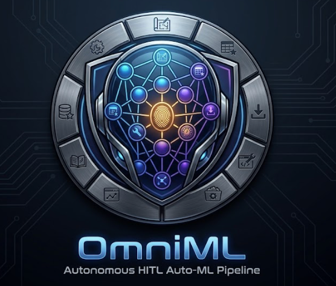

<p align="center">
  
</p>

<h1 align="center">🤖 OmniML — Autonomous HITL Auto-ML Pipeline</h1>

<p align="center">
  <strong>Describe a problem. Get a trained model. Zero boilerplate.</strong>
</p>

<p align="center">
  <a href="#-key-features">Features</a> •
  <a href="#-architecture">Architecture</a> •
  <a href="#%EF%B8%8F-installation">Install</a> •
  <a href="#-docker">Docker</a> •
  <a href="#-usage">Usage</a> •
  <a href="#-project-structure">Structure</a> •
  <a href="#-roadmap">Roadmap</a>
</p>

---

**OmniML** is a production-grade autonomous machine learning platform. It orchestrates a multi-agent **LangGraph** workflow that automates the entire ML lifecycle — from neural architecture design and real-world dataset sourcing to hyperparameter optimization, live training monitoring, and deployment-ready model export.

Powered by **Groq** (`openai/gpt-oss-120b`) for sub-second LLM reasoning, **Chainlit** for a premium conversational interface, and a deep **Human-in-the-Loop** system that keeps humans in control at every critical decision point.

---

## ✨ Key Features

### 🧠 Multi-Agent Orchestration

A densely orchestrated LangGraph state machine with **9 specialized agents**:

| Agent | Role |
|---|---|
| **Architect** | Generates neural network architectures dynamically via LLM, rendered as an interactive visual graph |
| **Kaggle Sourcer** | Searches and ranks real-world Kaggle datasets matched to your problem |
| **Dataset Downloader** | Downloads, validates, and stages the chosen CSV for training |
| **EDA Analyzer** | Real-time data profiling — distributions, correlations, outliers, missing values — with Groq-powered AI narration |
| **HPT Node** | Derives Optuna hyperparameter search spaces from your visual architecture |
| **Engineer** | Generates production-grade PyTorch + Optuna training scripts from graph topology |
| **Self-Healing Debugger** | Intercepts runtime crashes and auto-patches scripts using AST analysis + LLM repair (up to 3 retries) |
| **ArXiv Comparator** | Fetches scholarly benchmarks and performs quantitative gap analysis against SOTA |
| **Model Deployer** | Exports trained models to PyTorch, TorchScript, and ONNX with a ready-to-serve FastAPI + Docker bundle |

### 📦 Real-World Data Sourcing
Integrated Kaggle API to search, rank, download, and preprocess actual CSV datasets on-the-fly — no manual data wrangling.

### 🧪 Hyperparameter Optimization
Automated **Optuna** tuning with live trial-by-trial streaming to an interactive HPT dashboard. Search spaces are derived directly from your visual architecture.

### 📊 Live Training Analytics
Real-time dashboards polling training progress at 800ms intervals:
- **Loss & Accuracy Charts** — dual-pane with train/val curves
- **Epoch Metrics Table** — scrollable with latest-epoch highlighting
- **Groq Live Commentary** — AI-generated observations every 5 epochs
- **Subprocess Log** — raw training output stream

### 🤚 Deep Human-in-the-Loop (HITL)

Five interactive decision points where the human retains full control:

1. **Visual Flow Editor** — Drag, drop, and wire neural network layers via React Flow. Add Dense, LSTM, Conv1D, Dropout, BatchNorm nodes and connect them visually.
2. **Dataset Selection** — Choose from ranked real-world Kaggle datasets with metadata cards (rows, columns, size, downloads).
3. **EDA Dashboard** — Explore interactive data profiling before committing to training.
4. **Training Config Panel** — Define epochs, learning rate, batch size, optimizer, early stopping, class weights, and more.
5. **Compute Strategy** — Choose between local subprocess execution or cloud GPU deployment.

### 🚀 One-Click Model Deployment
After training completes, OmniML automatically exports:
- `model.pt` — PyTorch weights
- `model_scripted.pt` — TorchScript for production
- `model.onnx` — ONNX for cross-platform inference
- `serve_api.py` — Ready-to-run FastAPI serving endpoint
- `Dockerfile` + `requirements.txt` — Containerized deployment bundle

---

## 🏗 Architecture

```
User Query
    │
    ▼
┌─────────────┐
│  Architect   │ ← LLM generates graph architecture
└──────┬──────┘
       │
    ┌──▼──────────────┐
    │ HITL: Visual     │ ← React Flow drag-and-drop editor
    │ Flow Editor      │
    └──────┬──────────┘
           │
    ┌──────▼──────────┐
    │ Kaggle Sourcer   │ ← Search + rank real datasets
    └──────┬──────────┘
           │
    ┌──────▼──────────┐
    │ HITL: Dataset    │ ← User picks from top 3 matches
    │ Selection        │
    └──────┬──────────┘
           │
    ┌──────▼──────────┐
    │ Downloader +     │ ← Download CSV + profile data
    │ EDA Analyzer     │
    └──────┬──────────┘
           │
    ┌──────▼──────────┐
    │ HITL: Training   │ ← Configure hyperparameters
    │ Config Panel     │
    └──────┬──────────┘
           │
    ┌──────▼──────────┐
    │ HPT + Engineer   │ ← Optuna tuning + code generation
    └──────┬──────────┘
           │
    ┌──────▼──────────┐
    │ HITL: Compute    │ ← Local vs Cloud execution
    │ Strategy         │
    └──────┬──────────┘
           │
    ┌──────▼──────────┐     ┌─────────────┐
    │ Execution        │────▶│ Debugger     │ (auto-heal loop)
    │ Sandbox          │◀────│ Agent        │
    └──────┬──────────┘     └─────────────┘
           │
    ┌──────▼──────────┐
    │ ArXiv Comparator │ ← SOTA gap analysis
    └──────┬──────────┘
           │
    ┌──────▼──────────┐
    │ Model Deployer   │ ← Export PT/ONNX/TorchScript + API
    └──────┬──────────┘
           │
    ┌──────▼──────────┐
    │ Evaluator        │ ← Final report (Markdown + PDF)
    └─────────────────┘
```

---

## 🛠 Tech Stack

| Layer | Technology |
|---|---|
| **Orchestration** | LangGraph (Multi-Agent State Machine) |
| **LLM Inference** | Groq (`openai/gpt-oss-120b`) — Ollama and OpenAI also supported |
| **Frontend** | Chainlit 2.x with custom persistence, HTML rendering, and embedded iframes |
| **Visual Editor** | React Flow (Vite + TypeScript + Dagre layout) |
| **ML Frameworks** | PyTorch, Scikit-Learn, XGBoost |
| **HPT** | Optuna |
| **Visualization** | Chart.js (dashboards), Matplotlib, Seaborn (reports) |
| **Data Source** | Kaggle Open Datasets API |
| **Model Export** | TorchScript, ONNX |
| **Deployment** | FastAPI + Docker |
| **Persistence** | SQLite (Chainlit chat history) |

---

## ⚙️ Installation

### 1. Clone the Repository
```bash
git clone https://github.com/bytes06runner/OmniML.git
cd OmniML
```

### 2. Environment Setup

OmniML requires **Python 3.12+**.

```bash
python3 -m venv venv312
source venv312/bin/activate
pip install -r requirements.txt
```

### 3. Configure Environment Variables

Copy the example and fill in your keys:

```bash
cp .env.example .env
```

**Required variables:**
```env
GROQ_API_KEY=your_groq_api_key
KAGGLE_USERNAME=your_kaggle_username
KAGGLE_KEY=your_kaggle_api_key
CHAINLIT_AUTH_SECRET=your_random_secret
```

See [`.env.example`](.env.example) for the full list of optional settings (Ollama, OpenAI, Docker sandbox, Modal, RunPod).

### 4. Build the Visual Editor (optional — dist/ is pre-built)

Only needed if you modify the React Flow editor source:

```bash
cd public/react_flow_editor
npm install
npm run build
cd ../..
```

---

## 🐳 Docker

### Run with Docker

```bash
docker build -t omniml .
docker run -p 8001:7860 \
  -e GROQ_API_KEY=your_key \
  -e KAGGLE_USERNAME=your_username \
  -e KAGGLE_KEY=your_kaggle_key \
  -e CHAINLIT_AUTH_SECRET=your_secret \
  omniml
```

The app will be available at `http://localhost:8001`.

### Deploy to Hugging Face Spaces

The included `Dockerfile` is pre-configured for [Hugging Face Spaces](https://huggingface.co/spaces) (Docker SDK). It runs as a non-root user on port `7860` as required by the platform.

---

## 🚀 Usage

### Launch locally

```bash
python start.py
```

Open [http://localhost:8001](http://localhost:8001) in your browser.

### Example Prompts

> *"I need an AI model to diagnose whether a patient has breast cancer based on static biopsy records and tabular cell measurements. Find me a dataset and build the optimal architecture."*

> *"Build a model to predict housing prices based on demographic data and historical sale records."*

> *"Detect credit card fraud patterns using anonymous transaction telemetry."*

> *"Classify customer churn from telecom subscription data."*

---

## 📁 Project Structure

```
OmniML/
├── app.py                          # Chainlit entry point — UI, endpoints, action callbacks
├── graph.py                        # LangGraph state machine — all 9 agents defined here
├── tools.py                        # Kaggle, HuggingFace, ArXiv API tool wrappers
├── start.py                        # Production launcher with AnyIO compat patches
├── requirements.txt                # Python dependencies
├── Dockerfile                      # Docker / HF Spaces deployment config
├── setup.py                        # Package install config
├── .env.example                    # Full environment variable reference
├── chainlit.md                     # Chainlit welcome markdown
│
├── anomallm/                       # Core OmniML SDK
│   ├── __init__.py                 # Package exports
│   ├── persistence.py              # SQLite data layer for Chainlit chat persistence
│   ├── trainer.py                  # Auto-ML training engine
│   ├── detector.py                 # Feature scaling and discovery
│   ├── explainer.py                # Model explanation utilities
│   ├── reporter.py                 # Report generation
│   ├── backends/                   # Execution backends
│   │   ├── subprocess.py           # Local subprocess execution
│   │   ├── docker.py               # Docker sandbox execution
│   │   ├── modal.py                # Modal serverless GPU
│   │   └── runpod.py               # RunPod serverless GPU
│   └── llm/                        # LLM provider abstractions
│       ├── groq.py                 # Groq provider
│       ├── openai.py               # OpenAI provider
│       └── ollama.py               # Ollama (offline) provider
│
└── public/                         # Frontend assets served by Chainlit
    ├── style.css                   # Global custom CSS
    ├── custom.js                   # Custom JavaScript
    ├── logo.png                    # OmniML branding
    ├── react_flow_editor/          # Visual architecture editor (React + Vite)
    │   ├── src/                    # TypeScript source
    │   └── dist/                   # Pre-built production bundle
    ├── eda_dashboard/              # Interactive EDA profiling dashboard
    ├── training_console/           # Live training progress dashboard
    ├── hpt_console/                # Hyperparameter tuning dashboard
    ├── training_config/            # HITL training configuration panel
    ├── pipeline_status/            # Pipeline stage tracker widget
    └── deployment_dashboard/       # Model export & deployment dashboard
```

---

## 📅 Roadmap

- [x] Multi-agent LangGraph orchestration with 9 specialized nodes
- [x] Interactive React Flow visual architecture editor
- [x] Real-world Kaggle dataset sourcing and download
- [x] Interactive EDA dashboard with AI narration
- [x] HITL training configuration panel
- [x] Optuna hyperparameter optimization with live dashboard
- [x] Self-healing debugger with AST validation + LLM repair
- [x] ArXiv literature comparator with SOTA gap analysis
- [x] Model export pipeline (PyTorch, TorchScript, ONNX, FastAPI)
- [x] Deployment dashboard with artifact browser
- [x] Docker and Hugging Face Spaces deployment support
- [ ] End-to-end Kaggle Cloud GPU execution with kernel polling
- [ ] Support for unstructured text and image datasets
- [ ] Multi-model comparison and ensemble strategies
- [ ] Automated feature engineering agent
- [ ] CI/CD pipeline integration for model versioning

---

<p align="center">
  <strong>OmniML</strong> — Autonomous, Transparent, and Production-Grade Machine Learning.
</p>
